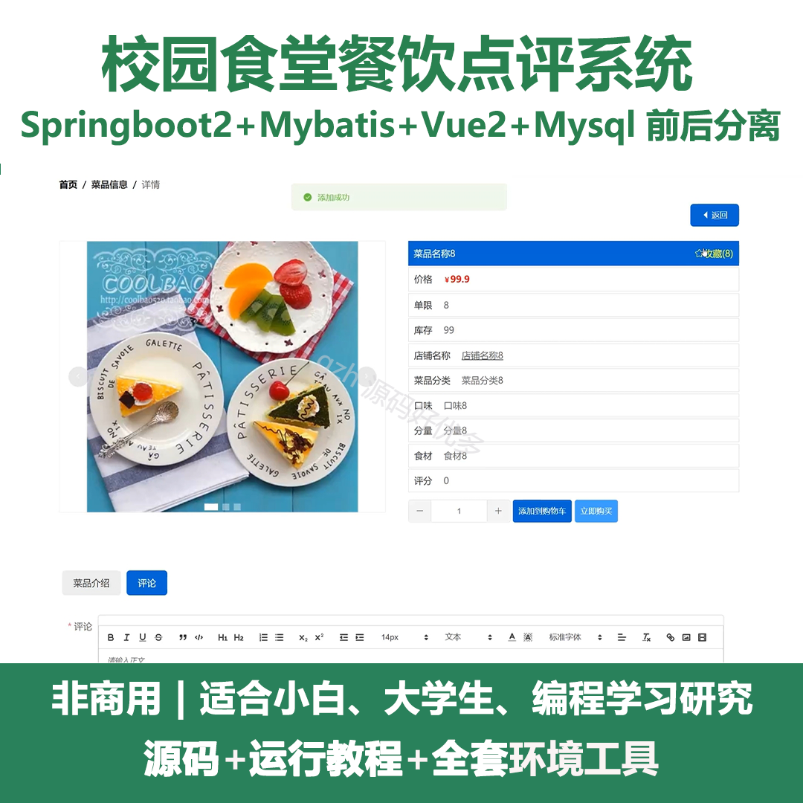
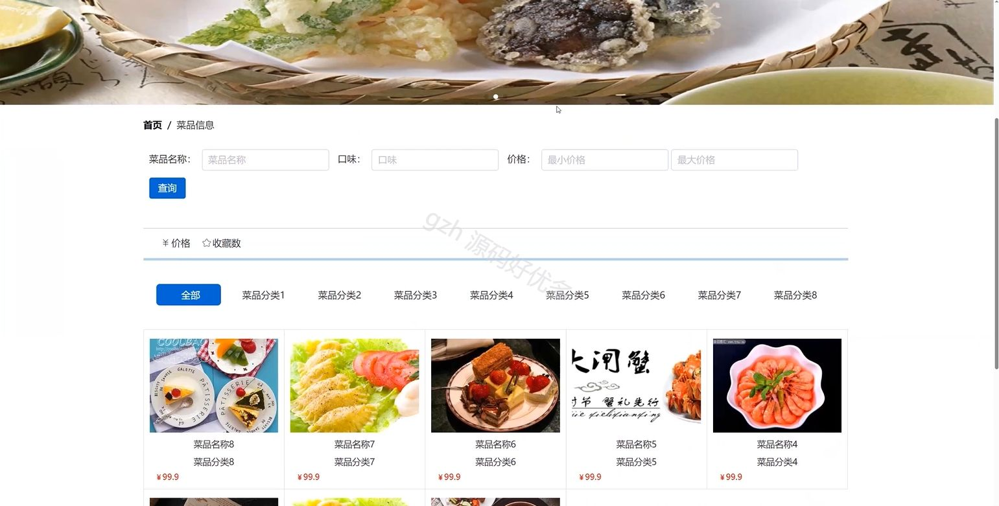
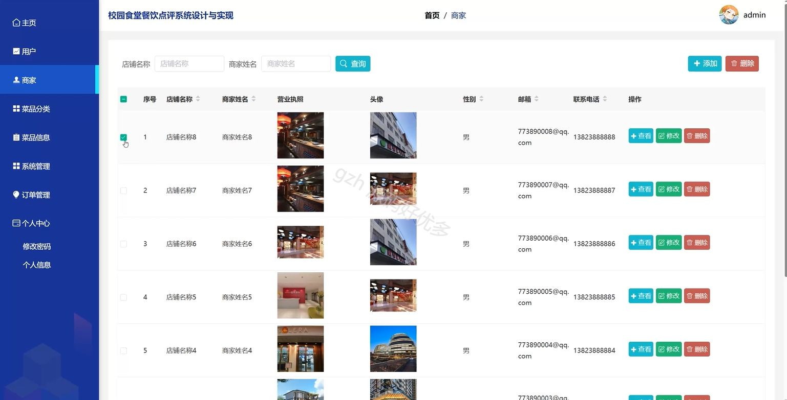
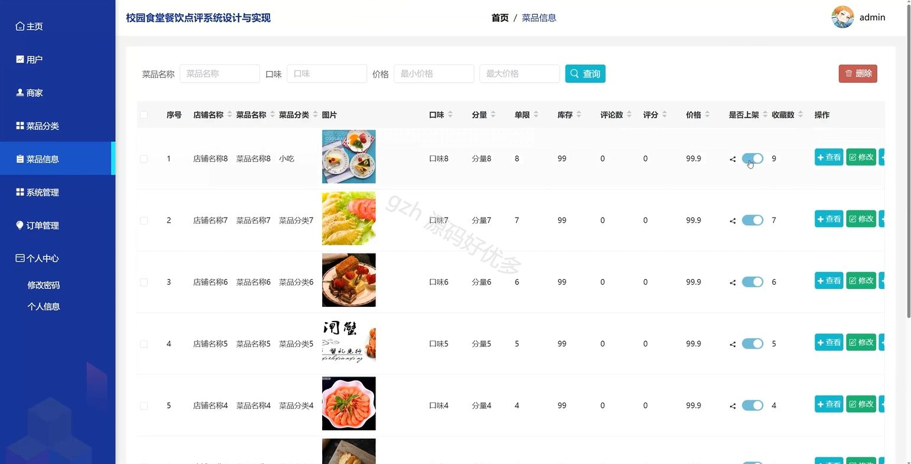
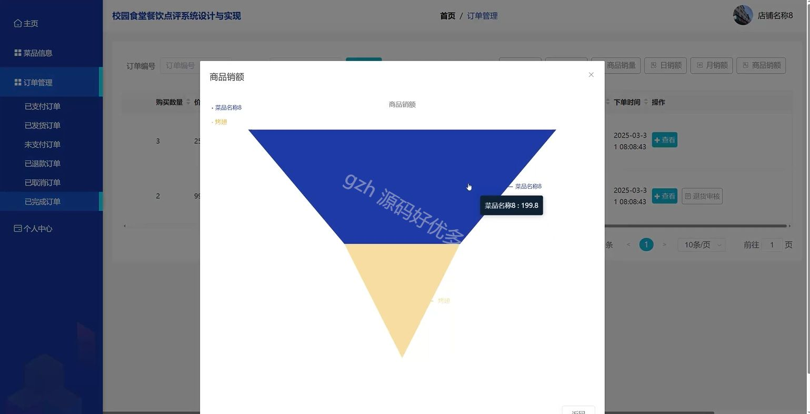
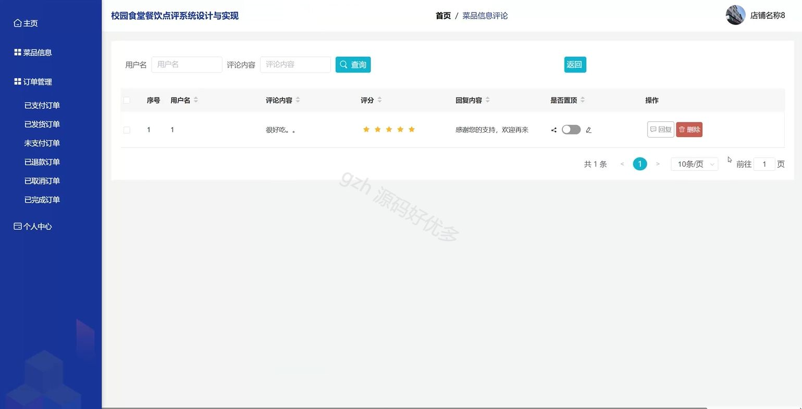

# springbootA502D
springbootA502D校园食堂餐饮点评系统
## 查看主页获取源码

### 一、关键词

菜品信息、美食资讯、菜品评价

 

### 二、作品包含

源码+数据库+全套环境和工具资源+部署教程

 

### 三、项目技术

前端技术：Html、Css、Js、Vue2.0、Element-ui 
后端技术：Java、SpringBoot2.0、MyBatis

  

 

### 四、运行环境（以下版本亲测，其他版本未知，请自测）

开发工具：IDEA/eclipse  + VSCODE

数据库：MySQL5.7（最低要5.7版本）

数据库管理工具：Navicat10以上版本

环境配置软件： JDK1.8 + Maven3.6.3

前端Nodejs：14

浏览器：谷歌浏览器

 

### 五、项目介绍

项目编号：springbootA502D

校园食堂餐饮点评系统通过收集师生对食堂菜品等方面的评价与反馈，助力食堂优化餐饮质量、提升服务水平并增强师生就餐满意度。

角色：管理员、用户、商家

用户功能：首页、菜品信息、美食资讯、个人中心、修改密码、我的订单、我的地址、我的收藏。

管理员功能：主页、用户、商家、菜品分类、菜品信息、系统管理、订单管理、个人中心。

商家功能：主页、菜品信息、订单管理、个人中心。

 

### 六、运行截图

